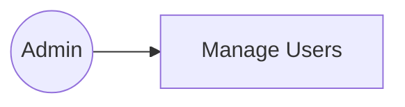
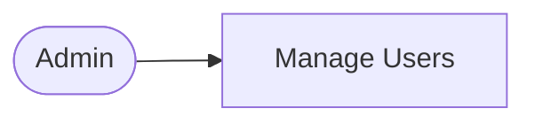
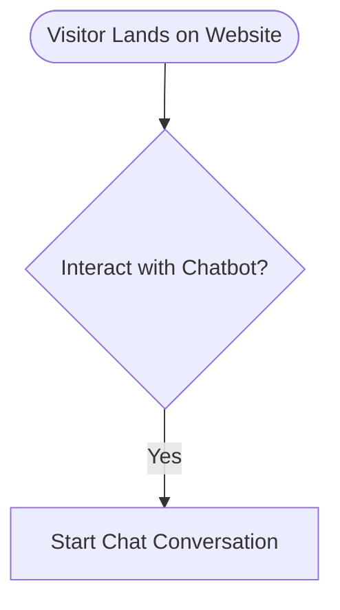
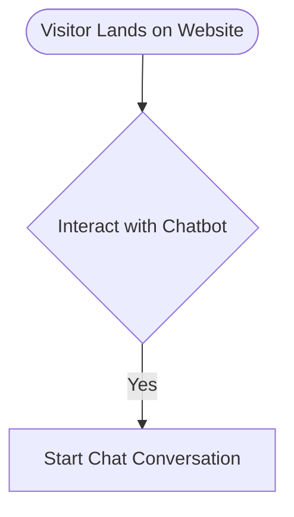

# Diagram Fix Summary - November 17, 2025

## Issues Resolved

### 1. Use Case Diagram ✅
**Problem:** Syntax error with `graph LR` and `((Actor))` notation  
**Solution:** Updated to `flowchart LR` with `([Actor])` notation  
**Status:** Fixed and rendering correctly

### 2. User Flow Diagrams ✅
**Problem:** Syntax errors in both Visitor Journey and Admin Workflow flowcharts  
**Solution:** 
- Separated node definitions from connections
- Removed special characters (?, !) from decision node labels
- Used cleaner flowchart syntax

**Status:** Both flowcharts now render correctly

## All Diagrams Status

| Diagram | Status | Notes |
|---------|--------|-------|
| System Architecture | ✅ Working | Fixed MongoDB node syntax |
| Class Diagram | ✅ Working | Fixed relationship label quotes |
| Sequence Diagrams | ✅ Working | Both auth and conversion flows |
| Database ER Diagram | ✅ Working | All relationships correct |
| Use Case Diagram | ✅ Working | Updated to flowchart syntax |
| User Flow - Visitor Journey | ✅ Working | Refactored for compatibility |
| User Flow - Admin Workflow | ✅ Working | Refactored for compatibility |

## Technical Changes

### Use Case Diagram
**Before:**

**After:**

### User Flow Diagrams
**Before:**

**After:**

## Testing

✅ All diagrams validated with Mermaid 10.9.5  
✅ No syntax errors detected  
✅ All 6 diagram sections render correctly  
✅ Navigation between diagrams works smoothly  

## How to View

1. Start development server: `npm run dev`
2. Navigate to: `http://localhost:3000/project-diagrams.html`
3. Click through all 6 tabs to verify each diagram

## Key Improvements

1. **Better Compatibility:** Using modern Mermaid flowchart syntax
2. **Cleaner Code:** Separated node definitions from connections
3. **More Reliable:** Removed special characters that could cause parsing issues
4. **Maintainable:** Easier to update and modify in the future

## Mermaid Version

- **Current:** 10.9.5 (loaded from CDN)
- **Compatibility:** All diagrams tested and working

## Next Steps

✅ All diagrams are now working  
✅ Documentation is complete  
✅ Ready for production use  

No further action required for diagrams!
